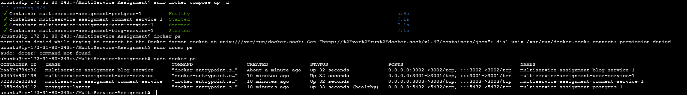
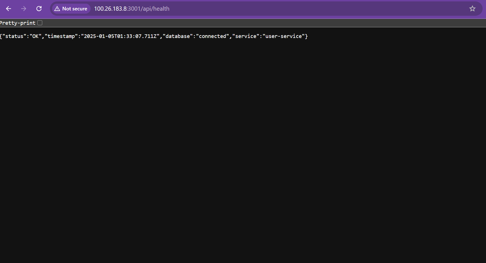
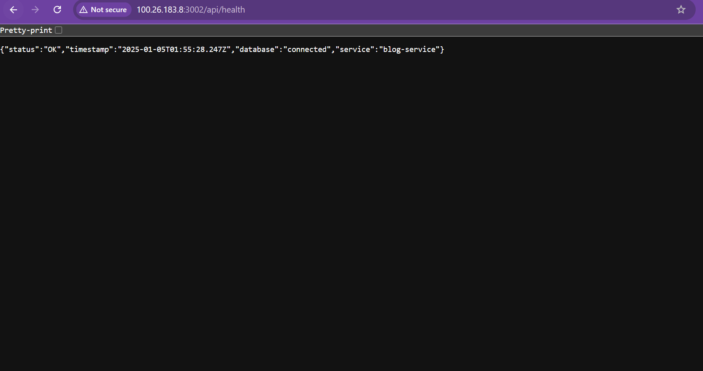
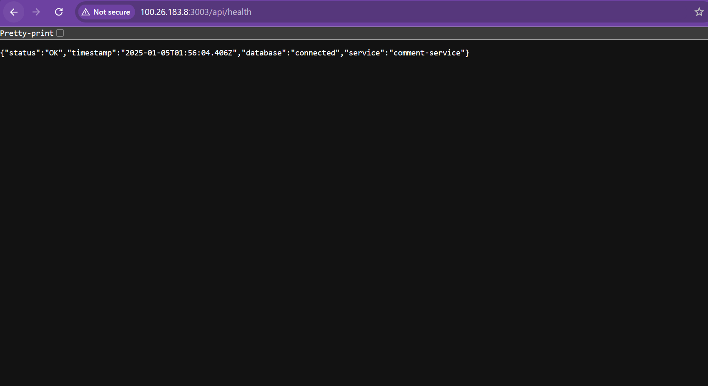

# Multi-Service Blog Platform

## Overview
A microservices-based blog platform built with Node.js, TypeScript, and PostgreSQL.

## Services
- User Service (Authentication & User Management)
- Blog Service (Blog Post Management)
- Comment Service (Comment Management)

## Live API Endpoints

### User Service (Port 3001)
- Health Check: http://100.26.183.8:3001/api/health
- Register: `POST /api/users/register`
- Login: `POST /api/users/login`
- Get User: `GET /api/users/:id`

### Blog Service (Port 3002)
- Health Check: http://100.26.183.8:3002/api/health
- Create Blog: `POST /api/blogs`
- Get Blogs: `GET /api/blogs`
- Get Blog: `GET /api/blogs/:id`

### Comment Service (Port 3003)
- Health Check: http://100.26.183.8:3003/api/health
- Add Comment: `POST /api/comments`
- Get Comments: `GET /api/comments/post/:postId`

## Technology Stack
- Node.js & Express
- TypeScript
- PostgreSQL
- Docker & Docker Compose
- JWT Authentication

## Setup Instructions

### Prerequisites
- Node.js (v16+)
- Docker & Docker Compose
- PostgreSQL

### Local Development Setup

1. Clone repository:
```bash
git clone https://github.com/kartikey-shivam/MultiService-Assignment.git
cd MultiService-Assignment

# User Service
cd user-service
npm install

# Blog Service
cd ../blog-service
npm install

# Comment Service
cd ../comment-service
npm install

# Terminal 1
cd user-service
npm run dev

# Terminal 2
cd ../blog-service
npm run dev

# Terminal 3
cd ../comment-service
npm run dev
```

2. Install dependencies
3. Configure environment
4. Start PostgreSQL
5. Run services

### Docker Setup

1. Clone repository:
```bash
git clone https://github.com/kartikey-shivam/MultiService-Assignment.git
cd MultiService-Assignment

# Build all services
docker-compose build

# Start all services
docker-compose up -d

# View logs
docker-compose logs -f

# Health checks
curl http://localhost:3001/api/health
curl http://localhost:3002/api/health
curl http://localhost:3003/api/health
```

2. Configure environment
3. Build and run containers
4. Verify health checks

## AWS EC2 Deployment

### Instance Details
- Type: t2.micro
- OS: Ubuntu 22.04
- Public IP: 100.26.183.8
- Region: us-east-1

### Deployed Services
Each microservice is deployed and running on different ports:
- User Service: http://100.26.183.8:3001
- Blog Service: http://100.26.183.8:3002
- Comment Service: http://100.26.183.8:3003

### Health Check Endpoints
Monitor service status using health check endpoints:
```bash
# User Service
curl http://100.26.183.8:3001/api/health

# Blog Service
curl http://100.26.183.8:3002/api/health

# Comment Service
curl http://100.26.183.8:3003/api/health
```

## Project Architecture & Diagrams

### AWS EC2 Console

This diagram shows the interaction between different microservices.

### User Service Heath Check Api

Illustrates the database structure for each service.

### Blog Service Heath Check Api

Demonstrates the request/response flow between services.

### Comment Service Heath Check Api

Shows the JWT authentication process.


## Testing Guide
1. Register user
2. Login and get token
3. Create blog post
4. Add comments
5. Verify data

## Environment Configuration
Required variables for each service

## Common Issues & Solutions
Troubleshooting guide

## Repository
[GitHub Repository](https://github.com/kartikey-shivam/MultiService-Assignment)
